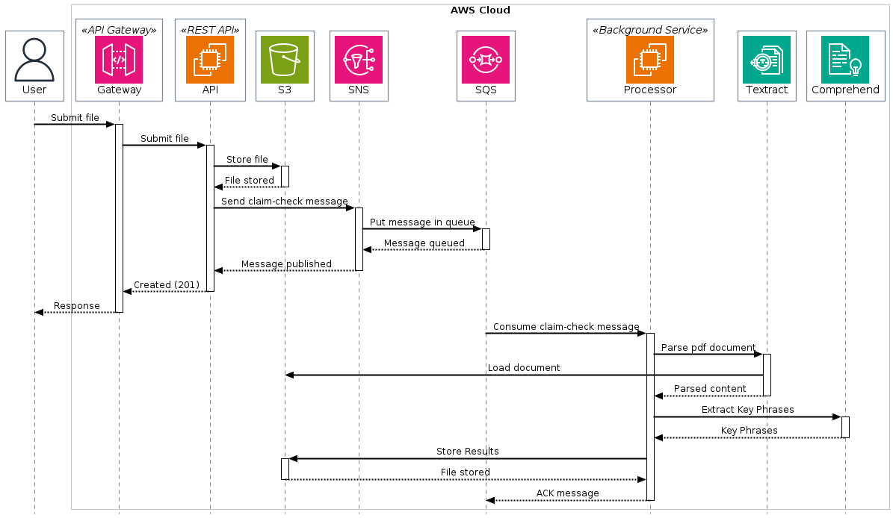
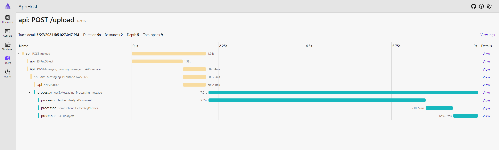

# Claim-Check Pattern via AWS.Messaging in .NET

This repository demonstrates how to use AWS.Messaging based to implement a claim-check pattern.

The claim check pattern is a messaging pattern used to offload large or complex data from the main message payload to an external storage system. This allows the main message payload to remain lightweight and efficient, while the actual data is stored separately and can be retrieved when needed.

In this repository, we demonstrate how to implement the claim check pattern using AWS.Messaging in .NET. The code examples provided show how to offload data to AWS services such as S3, allowing for scalable and efficient processing of messages.

Arguably, in the world of AWS, there are cloud-native alternatives to the canonical claim check pattern. For example, you can subscribe to S3 events via SNS. However, this repository was created for learning purposes and does not serve as a reference architecture.

## Use Case

Upload a pdf file so it can be analyzed by background service.

In this case we are parsing and analyzing key phrases of pdf documents.

## Process

1. PDF file ingestion. File is uploaded to S3 and claim check message is sent to SNS.
2. Claim check message is consumed and file is processed based on Amazon Textract and AmazonComprehend, the result is written back to S3 as separate file with.
   1. Amazon Textract fetches the text from PDF
   2. Amazon Comprehend performs key phrases extraction

## Reference

1. <https://github.com/awslabs/aws-dotnet-messaging>
2. <https://aws.amazon.com/blogs/developer/introducing-the-aws-message-processing-framework-for-net-preview/>
3. <https://learn.microsoft.com/en-us/azure/architecture/patterns/claim-check>
4. <https://docs.aws.amazon.com/sdk-for-net/v3/developer-guide/msg-proc-fw.html>
5. <https://www.enterpriseintegrationpatterns.com/patterns/messaging/StoreInLibrary.html>
6. <https://docs.aws.amazon.com/prescriptive-guidance/latest/automated-pdf-analysis-solution/welcome.html>
7. <https://github.com/plantuml/plantuml-server>
8. <https://github.com/awslabs/aws-icons-for-plantuml>
